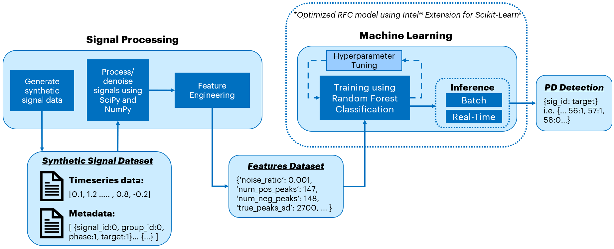

# Powerline Fault Detection

## Introduction
This reference kit implements an end-to-end (E2E) workflow with the help of [Intel® Distribution for Python*](https://www.intel.com/content/www/us/en/developer/tools/oneapi/distribution-for-python.html) and [Intel® Extension for Scikit-Learn*](https://www.intel.com/content/www/us/en/developer/tools/oneapi/scikit-learn.html) to detect faulty signals from measured power line voltage. With this solution, the detected signals can then be addressed early enough to avoid permanent and expensive damage.

Check out more workflow examples in the [Developer Catalog](https://developer.intel.com/aireferenceimplementations).

## Solution Technical Overview

Faults in overhead electric transmission lines can lead to a destructive phenomenon called partial discharge (PD). If left alone, partial discharges can eventually destroy equipment. Overhead electric transmission lines run for hundreds of thousands of miles all over the United States of America alone, so manually inspecting the lines for damages that don’t cause an immediate outage is expensive. However, if left alone, undetected faulty lines can lead to partial discharges. Using Machine Learning (ML) to proactively detect partial discharges can reduce maintenance costs and prevent power outages and fires.

The purpose of this workflow is to process and analyze the signals from a 3-phase power supply system, used in power lines, to predict whether or not a signal has a partial discharge (which means it is faulty). Using SciPy* and NumPy* calculations, we first extracted features from the synthetic data signals we generated using python packages and open-source libraries, to then apply those features into a supervised ML pipeline using Random Forest Classification (RFC) to infer the signal status. Intel® Extension for Scikit-Learn* is used to optimize this pipeline for better performance.

The solution contained in this repo uses the following Intel® packages:

* ***Intel® Distribution for Python****

	The [Intel® Distribution for Python*](https://www.intel.com/content/www/us/en/developer/tools/oneapi/distribution-for-python.html) provides:

  * Scalable performance using all available CPU cores on laptops, desktops, and powerful servers.
  * Support for the latest CPU instructions.
  * Near-native performance through acceleration of core numerical and machine learning packages with libraries like the Intel® oneAPI Math Kernel Library (oneMKL) and Intel® oneAPI Data Analytics Library.
  * Productivity tools for compiling Python* code into optimized instructions.
  * Essential Python* bindings for easing integration of Intel® native tools with your Python* project.

* ***Intel® Extension for Scikit-Learn\****

    Designed for data scientists, [Intel® Extension for Scikit-Learn*](https://www.intel.com/content/www/us/en/developer/tools/oneapi/scikit-learn.html) is a seamless way to speed up your Scikit-Learn* applications for machine learning to solve real-world problems. This extension package dynamically patches scikit-learn estimators to use Intel® oneAPI Data Analytics Library (oneDAL) as the underlying solver, while achieving the speed up for your machine learning algorithms out-of-box.

For more details, visit [Intel® Distribution for Python*](https://www.intel.com/content/www/us/en/developer/tools/oneapi/distribution-for-python.html), [Intel® Extension for Scikit-Learn*](https://www.intel.com/content/www/us/en/developer/tools/oneapi/scikit-learn.html), the [Powerline Fault Detection](https://github.com/oneapi-src/powerline-fault-detection) GitHub repository.

## Solution Technical Details
For data processing, we will use python libraries SciPy* and NumPy*. The signals (generated using periodic functions and Gaussian noise) are passed as NumPy* arrays. Properties such as signal-to-noise ratio, peak features, etc., are used to extract features which will be used in ML model building. SciPy* and NumPy* are built to handle these heavy vector calculations on the arrays.

The features are then passed into a Random Forest model, which is trained and used to predict the faulty signals. Random Forest is a type of ensemble algorithm, which provides the benefits of increased performance and less chance of overfitting. This helps make the model applicable to the general problem rather than this specific dataset.

This section provides key implementation details on the proposed reference solution for the target use case. It is organized as follows:

1. Proposed reference end-to-end architecture.
2. Setting up the Intel® environment.
3. Executing the optimized reference architecture pipeline (data loading and processing, supervised ML training/hyperparameter tuning and inference) using [Intel® Distribution for Python*](https://www.intel.com/content/www/us/en/developer/tools/oneapi/distribution-for-python.html) and [Intel® Extension for Scikit-Learn*](https://www.intel.com/content/www/us/en/developer/tools/oneapi/scikit-learn.html).

### Proposed Architecture using Intel® Packages

As mentioned before, the raw signal timeseries data and metadata is synthetically generated using a combination of TimeSynth* and other NumPy*/SciPy* functions. The data generation will be executed as part of the pipeline. After this step, we use NumPy* and SciPy* to process these signals to denoise them for greater accuracy before extracting features to be passed onto training. The supervised ML model training is performed using Random Forest Classification, which is used because of its advantages of using ensemble learning: increased performance and less likelihood of overfitting. We also use hyperparameter tuning with cross validation to optimize the model configuration and increase accuracy for inference. The model can then be used for streaming or batch inference. This entire pipeline is executed running one script, `run_benchmarks.py`.



Each step in the pipeline is optimized using Intel® technologies and the ML optimizations from Intel® Extension for Scikit-Learn* are enabled for faster performance.

### Dataset

The dataset used for this workflow is synthetically generated. By default, it a set of 9600 signals' timeseries data and metadata. The synthetic data is then passed to the pipeline that is the focus of this reference kit.

>Note: Generating synthetic data is a part of this reference kit's pipeline execution, but it is not a part of the analysis and benchmarking. It is just the prerequisite step in the pipeline to have the data.

Each signal contains 10,000 floating point values depicting one cycle of voltage measured of a 50 Hertz (Hz) 3-phase system power line's voltage. Signal metadata includes the **signal ID**, **group ID** and **phase** since this is a 3-phase power system.
The dependent variable that we are trying to predict is whether or not the signal has PD, and this is the **target** variable. A **target** value of 0 is negative, which means the signal does not have partial discharge and is functioning normally, whereas a value of 1 means that it is a positive target, so there is partial discharge present and the signal is deemed faulty.

For reference, the table below shows what some rows from the signal dataframe may look like. Note that this is column-based, so the signal ID is the column name and the values in one column represent one signal's voltage measured at each time increment.

| **0**                | **1**          | **2**             | **3**           | **...**
| :---                 | :---           | :---              | :---            | :---
| -3.366481932	       | -13.24926079   | 10.85013064       | 1.733765166     | ...
| -0.557262024	       | -11.95544088   | 13.95043041	    | 1.093923156     | ...
| -3.600549611         | -11.76913344   | 10.82880894	    | -0.157187225    | ...
| ...                  | ...            | ...               | ...             | ...

For reference, the table below is what some rows from the metadata dataframe may look like. Note that here the signals IDs are row-based now, but the same ID is used to map to the relevant column in the signal dataframe. This means that the timeseries signal above in column "0" of the signal dataframe maps to the row with sig_id 0 below in the metadata dataframe.

| **Sig_id**           | **Group_id**   | **Phase**        | **Target**          
| :---                 | :---           | :---             | :---            
| 0	                   | 0	            | 0	               | 0     
| 1	                   | 0	            | 1	               | 0    
| 2                    | 0	            | 2	               | 0    
| ...                  | ...            | ...              | ...      

## Validated Hardware Details
There are workflow-specific hardware and software setup requirements to run this use case.

| Recommended Hardware
| ----------------------------
| CPU: Intel® 2nd Gen Xeon® Platinum 8280 CPU @ 2.70GHz or higher
| RAM: 187 GB
| Recommended Free Disk Space: 20 GB or more

Operating System: Ubuntu* 22.04 LTS.

## How it Works

### Data Processing
The raw synthetic data is then passed into functions in `data_processing.py` and called in `run_benchmarks.py` during code execution. The signals are individually processed to filter out the noise and extract relevant features. These extracted features are then combined into a dataframe which is then passed down to the ML pipeline for training and inference.

### Model Training/Hyperparameter Tuning + Inference
Once the features are generated, the data is now ready to be used in model training. Random Forest Classification is used in this instance for its advantages listed in previous sections as a supervised binary classification algorithm. The model is trained on 16 numeric features for each signal, with hyperparameter tuning and cross-validation integrated. The input for both training and inference is the same format features dataset, so we used a Scikit-Learn* function to split the data into train and test input, with a 7:3 split ratio respectively. The default dataset size is 9600 so the training is performed on 6720 signals' feature data. An important step in the training function is hyperparameter tuning using grid search and cross validation. These techniques check combinations of hyperparameters for the model to be trained on and outputs the model that gives the most accurate results, which is then used for inferencing.

### Batch/Streaming Prediction

The model then runs either batch inference or simulated real-time inference, depending on the runtime configuration. As the test input ratio was 30%, batch inference is run on 2880 signals' feature data. Real-time inference is simulated and benchmarked by randomly sampling one signal from the test dataset 1000 times, saving each individual prediction as well as taking the average time for the 1000 iterations for our real-time benchmark. These functions are in `train_and_predict.py` and called in `run_benchmarks.py`.

### Expected input and output for each step of pipeline

#### Data Processing

| **Expected Input**     | **Expected Output**                   | **Comment**              
| :---                   | :---                                  | :---                
| Signal timeseries data as arrays of 10,000 floating point values, i.e. [0.1, 1.2, …, 0.8, -0.2], and metadata, i.e. [ {signal_id: 0, group_id: 0, phase: 1, target: 1}… {…} ] | Feature dataset to be used in training model, ie. {'noise_ratio': 0.001, 'num_pos_peaks': 147, 'num_neg_peaks': 148, 'true_peaks_sd': 2700, … } | Of the 16 numeric features, 1 is pre-processed and the rest are results after the signal gets filtered for noise 

#### Training/Hyperparameter tuning

| **Expected Input**     | **Expected Output**                   | **Comment**              
| :---                   | :---                                  | :---                
| Signal features dataset | Trained RFC model which is best estimator of given parameters after hyperparameter tuning | The model is tuned for the following parameters: n_estimators, max_leaf_nodes, and max_estimators.


#### Batch Prediction

| **Expected Input**     | **Expected Output**                   | **Comment**              
| :---                   | :---                                  | :---                
| Trained model and test data input | Array of prediction classes of whether a signal is faulty or not based on presence of partial discharge (0 for negative target = not faulty, and 1 for positive target = faulty), ie. {sig_id: target} ie. {… 56:1, 57:1, 58:0…} | The array is used to calculate accuracy and f1-scores for the model. 

#### Streaming Prediction

| **Expected Input**     | **Expected Output**                   | **Comment**              
| :---                   | :---                                  | :---                
| Trained model and test data input, which is a single row randomly sampled multiple times to simulate real-time inference  | Prediction class for individually inferenced signals (0 for negative target and 1 for positive), ie. {sig_id: target} ie. {… 130:1, 2:1, 488:0…} | Primary objective of running streaming inference is to benchmark time taken for prediction. Average time for a single prediction (with 1000 trials) is written to the log file. Each prediction is still saved and returned in the same format as batch, but must be noted this is **not** the same as batch inference.


## Get Started
Start by **defining an environment variable** that will store the workspace path, this can be an existing directory or one to be created in further steps. This ENVVAR will be used for all the commands executed using absolute paths.

[//]: # (capture: baremetal)
```bash
export WORKSPACE=$PWD/powerline-fault-detection
```

Define `DATA_DIR` and `OUTPUT_DIR`.

[//]: # (capture: baremetal)
```bash
export DATA_DIR=$WORKSPACE/data
export OUTPUT_DIR=$WORKSPACE/output
```

### Download the Workflow Repository
Create a working directory for the workflow and clone the [Main
Repository](https://github.com/oneapi-src/demand-forecasting) into your working
directory.

[//]: # (capture: baremetal)
```
mkdir -p $WORKSPACE && cd $WORKSPACE
```

```bash
git clone https://github.com/oneapi-src/powerline-fault-detection $WORKSPACE
```
### Set Up Conda
To learn more, please visit [install anaconda on Linux](https://docs.anaconda.com/free/anaconda/install/linux/).

```bash
wget https://repo.anaconda.com/miniconda/Miniconda3-latest-Linux-x86_64.sh
bash Miniconda3-latest-Linux-x86_64.sh
```
### Set Up Environment
Install and set the libmamba solver as default solver. Run the following commands:

```bash
conda install -n base conda-libmamba-solver -y
conda config --set solver libmamba
```

The [env/intel_env.yml](./env/intel_env.yml) file contains all dependencies to create the Intel® environment.

| **Packages required in YAML file**| **Version**
| :---                              | :--
| python                            | 3.10
| intelpython3_full                 | 2024.0 
| matplotlib                        | 3.8.0 
| pandas                            | 2.1.3 
| pip                               | 23.3.1
| timesynth                         | [e50cdb9](https://github.com/TimeSynth/TimeSynth/commit/e50cdb9015d415adf46a4eae161a087c5c378564) 

 Execute next command to create the conda environment.

```bash
conda env create -f $WORKSPACE/env/intel_env.yml
```

During this setup, `fault_detection_intel` conda environment will be created with the dependencies listed in the YAML configuration. Use the following command to activate the environment created above:

```bash
conda activate fault_detection_intel
```

## Supported Runtime Environment
You can execute this reference pipeline using the following environments:
* Bare Metal

### Run Using Bare Metal
Follow these instructions to set up and run this workflow on your own development system.

#### Set Up System Software
Our examples use the ``conda`` package and environment on your local computer. If you don't already have ``conda`` installed, go to [Set up conda](#set-up-conda) or see the [Conda* Linux installation instructions](https://docs.conda.io/projects/conda/en/stable/user-guide/install/linux.html).

#### Run Workflow
Once we create and activate the `fault_detection_intel` environment, we can run the next steps.

The `run_benchmarks.py` script **generates and processes the data**, **performs feature engineering**, **trains a Random Forest model with hyperparameter tuning**, and **performs inference using the trained model**. It also reports the time taken for relevant technologies at each step in the pipeline. 

> Before running the script, we need to ensure that the appropriate conda environment is activated.

The `run_benchmarks.py` script takes the following arguments:

```shell
usage: run_benchmarks.py [-l LOGFILE] [-s] [-n DATASET_LEN] 
    [--data_dir DATA_DIR] -o OUTPUT_DIR

options:
  -l LOGFILE, --logfile LOGFILE
                        log file to output benchmarking results to (default: None)
  -s, --streaming       run streaming inference (default: False)
  -n DATASET_LEN, --dataset_len DATASET_LEN
                        number of signals to generate, ideally a multiple of 3 (default: 9600)
  --data_dir DATA_DIR   save synthetic data generated to (default: None)
  -o OUTPUT_DIR, --output_dir OUTPUT_DIR
                        save outputs to (default: None)
```

For example, to run inference for 960, 3200, 9600 and 11200 signals, add the next parameters to `run_benchmarks.py` script, respectively:

[//]: # (capture: baremetal)
```shell
python $WORKSPACE/src/run_benchmarks.py -l $OUTPUT_DIR/logs/log_960.txt -n 960 \
    -o $OUTPUT_DIR/960 --data_dir $DATA_DIR/960
```

[//]: # (capture: baremetal)
```shell
python $WORKSPACE/src/run_benchmarks.py -l $OUTPUT_DIR/logs/log_3200.txt -n 3200 \
    -o $OUTPUT_DIR/3200 --data_dir $DATA_DIR/3200
```

[//]: # (capture: baremetal)
```shell
python $WORKSPACE/src/run_benchmarks.py -l $OUTPUT_DIR/logs/log_9600.txt -n 9600 \
    -o $OUTPUT_DIR/9600 --data_dir $DATA_DIR/9600
```

[//]: # (capture: baremetal)
```shell
python $WORKSPACE/src/run_benchmarks.py -l $OUTPUT_DIR/logs/log_11200.txt -n 11200 \
    -o $OUTPUT_DIR/11200 --data_dir $DATA_DIR/11200
```

For streaming inference, we only need to run one command to get the benchmark (since it is simulated by randomly sampling one signal from the test dataset 1000 times, saving each individual prediction as well as taking the average time for the 1000 iterations):

To run real-time inference for one of 960 signals generated, run the command:

[//]: # (capture: baremetal)
```shell
python $WORKSPACE/src/run_benchmarks.py -s -l $OUTPUT_DIR/logs/log_960_streaming.txt -n 960 \
    -o $OUTPUT_DIR/960_streaming --data_dir $DATA_DIR/960_streaming
```

#### Clean Up Bare Metal
Follow these steps to restore your `$WORKSPACE` directory to an initial step. Please note that all downloaded or created dataset files, conda environment, and logs created by the workflow will be deleted. Before executing next steps back up your important files.

```shell
# activate base environment
conda activate base
# delete conda environment created
conda env remove -n fault_detection_intel
```

```shell
# remove all outputs generated
rm -rf $OUTPUT_DIR $DATA_DIR
```

### Expected Output
Below sample outputs would be generated by the commands executed in [Run Workflow](#run-workflow) section:

For `dataset_len=960`:

```text
INFO:__main__:Beginning data generation
INFO:__main__:Data generated
INFO:__main__:Beginning data processing
INFO:__main__:Data processed
INFO:__main__:Total numpy time in data processing: 7.306015968322754
INFO:__main__:Total scipy time in data processing: 18.405130624771118
INFO:__main__:Beginning model training and inference
INFO:__main__:Training and inferencing complete
INFO:__main__:Dataset splitting time: 0.0023314952850341797
INFO:__main__:Training time: 118.98462414741516
INFO:__main__:Batch inference time: 0.19353175163269043
INFO:__main__:Batch inference accuracy: 0.9548611111111112
INFO:__main__:Batch inference macro F1: 0.705637235631732
```

For `dataset_len=3200`:

```text
INFO:__main__:Beginning data generation
INFO:__main__:Data generated
INFO:__main__:Beginning data processing
INFO:__main__:Data processed
INFO:__main__:Total numpy time in data processing: 26.141985654830933
INFO:__main__:Total scipy time in data processing: 62.58973574638367
INFO:__main__:Beginning model training and inference
INFO:sklearnex:sklearn.utils.validation._assert_all_finite: running accelerated version on CPU
INFO:__main__:Training and inferencing complete
INFO:__main__:Dataset splitting time: 0.003203153610229492
INFO:__main__:Training time: 133.78736805915833
INFO:__main__:Batch inference time: 0.038265228271484375
INFO:__main__:Batch inference accuracy: 0.965625
INFO:__main__:Batch inference macro F1: 0.8395128648068126
```

For `dataset_len=9600`:

```text
INFO:__main__:Beginning data generation
INFO:__main__:Data generated
INFO:__main__:Beginning data processing
INFO:__main__:Data processed
INFO:__main__:Total numpy time in data processing: 85.39899587631226
INFO:__main__:Total scipy time in data processing: 193.02739572525024
INFO:__main__:Beginning model training and inference
INFO:sklearnex:sklearn.utils.validation._assert_all_finite: running accelerated version on CPU
...
INFO:sklearnex:sklearn.utils.validation._assert_all_finite: running accelerated version on CPU
INFO:__main__:Training and inferencing complete
INFO:__main__:Dataset splitting time: 0.04280877113342285
INFO:__main__:Training time: 173.00040245056152
INFO:__main__:Batch inference time: 0.131119966506958
INFO:__main__:Batch inference accuracy: 0.9690972222222223
INFO:__main__:Batch inference macro F1: 0.842022642681621
```
For `dataset_len=11200`:

```text
INFO:__main__:Beginning data generation
INFO:__main__:Data generated
INFO:__main__:Beginning data processing
INFO:__main__:Data processed
INFO:__main__:Total numpy time in data processing: 99.85584139823914
INFO:__main__:Total scipy time in data processing: 225.84478378295898
INFO:__main__:Beginning model training and inference
INFO:sklearnex:sklearn.utils.validation._assert_all_finite: running accelerated version on CPU
...
INFO:sklearnex:sklearn.utils.validation._assert_all_finite: running accelerated version on CPU
INFO:__main__:Training and inferencing complete
INFO:__main__:Dataset splitting time: 0.00579071044921875
INFO:__main__:Training time: 178.87619042396545
INFO:__main__:Batch inference time: 0.1290571689605713
INFO:__main__:Batch inference accuracy: 0.9642857142857143
INFO:__main__:Batch inference macro F1: 0.8161711067666539
```

For streaming inference (adding `-s` flag) and `dataset_len=960`

```text
INFO:__main__:Beginning data generation
INFO:__main__:Data generated
INFO:__main__:Beginning data processing
INFO:__main__:Data processed
INFO:__main__:Total numpy time in data processing: 7.338321685791016
INFO:__main__:Total scipy time in data processing: 18.340595960617065
INFO:__main__:Beginning model training and inference
INFO:__main__:Training and inferencing complete
INFO:__main__:Dataset splitting time: 0.0023450851440429688
INFO:__main__:Training time: 122.25705790519714
INFO:__main__:Real-time inference time: 0.025083412408828734
```

A successful execution of this workflow should produce the following output files in `$OUTPUT_DIR`:

```text
├── 11200
│   └── predictions.csv
├── 3200
│   └── predictions.csv
├── 960
│   └── predictions.csv
├── 9600
│   └── predictions.csv
├── 960_streaming
│   └── predictions.csv
└── logs
    ├── log_11200.txt
    ├── log_3200.txt
    ├── log_9600.txt
    ├── log_960_streaming.txt
    └── log_960.txt
```

The executed commands generate synthetic data and save to `$DATA_DIR`:

```text
├── 11200
│   ├── metadata.csv
│   └── signal_data.csv
├── 3200
│   ├── metadata.csv
│   └── signal_data.csv
├── 960
│   ├── metadata.csv
│   └── signal_data.csv
├── 9600
│   ├── metadata.csv
│   └── signal_data.csv
└── 960_streaming
    ├── metadata.csv
    └── signal_data.csv
```

## Summary and Next Steps
In this reference kit the signals were processed and analyzed from a 3-phase power supply system to build a supervised machine learning pipeline using Random Forest Classification to infer the signal status.

The E2E workflow performed next tasks:
1. Training a Random Forest Classification model with hyperparameter tuning built-in.
2. Predicting outcomes over batch data using the trained Random Forest Classification model.
3. Execute testing for four dataset sizes: 960, 3200, 9600, and 11200 signals.
4. Repeating the inference exercise but for streaming data (run with the default size of 960 signals).

The proposed architecture using Intel® technologies and the ML optimizations from Intel® Extension for Scikit-Learn* provides faster performance on this fault detection task.

Fault detection with signal processing is a computationally expensive process, but with optimizations and cost-efficient data collection, the advantages of detecting partial discharge earlier will save much more money and resources eventually by avoiding complete outages and failures. The maintenance costs, as well as the need for extensive power line repair, will be lower if the problem is caught early enough. 
 

## Learn More
For more information about or to read about other relevant workflow examples, see these guides and software resources:

- [Intel® AI Analytics Toolkit (AI Kit)](https://www.intel.com/content/www/us/en/developer/tools/oneapi/ai-analytics-toolkit.html)
- [Intel® Distribution for Python*](https://www.intel.com/content/www/us/en/developer/tools/oneapi/distribution-for-Python*.html)
- [Intel® Optimization for TensorFlow*](https://www.intel.com/content/www/us/en/developer/tools/oneapi/optimization-for-tensorflow.html)
- [Intel® Neural Compressor](https://www.intel.com/content/www/us/en/developer/tools/oneapi/neural-compressor.html)

## Support
If you have questions or issues about this use case, want help with troubleshooting, want to report a bug or submit enhancement requests, please submit a GitHub issue.

## Appendix
\*Names and brands that may be claimed as the property of others. [Trademarks](https://www.intel.com/content/www/us/en/legal/trademarks.html).

### Acknowledgments
The following are open-source codebases that helped with the foundation of this workflow:
- https://gist.github.com/suhaskv/4b40f1b8c88c9f38abe7d583997bb9f6#file-get_all_peaks-py
- https://www.kaggle.com/code/xhlulu/exploring-signal-processing-with-scipy/notebook

### Notes

**Please see this dataset's applicable license for terms and conditions. Intel® does not own the rights to this data set and does not confer any rights to it.**

### Disclaimers
To the extent that any public or non-Intel datasets or models are referenced by or accessed using tools or code on this site those datasets or models are provided by the third party indicated as the content source. Intel does not create the content and does not warrant its accuracy or quality. By accessing the public content, or using materials trained on or with such content, you agree to the terms associated with that content and that your use complies with the applicable license.

Intel expressly disclaims the accuracy, adequacy, or completeness of any such public content, and is not liable for any errors, omissions, or defects in the content, or for any reliance on the content. Intel is not liable for any liability or damages relating to your use of public content.
