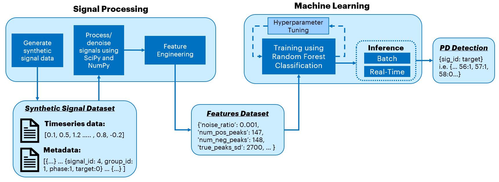
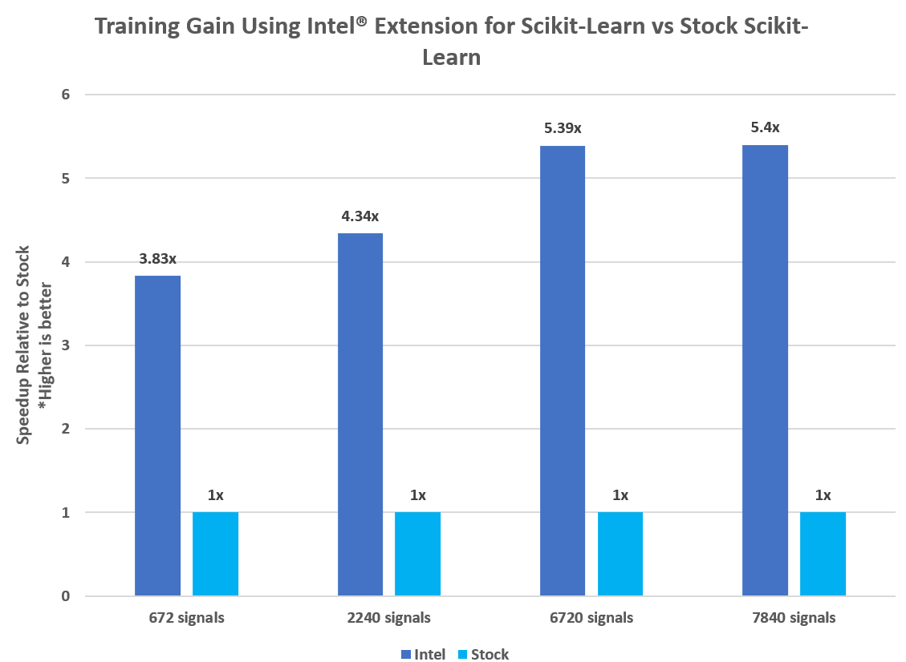
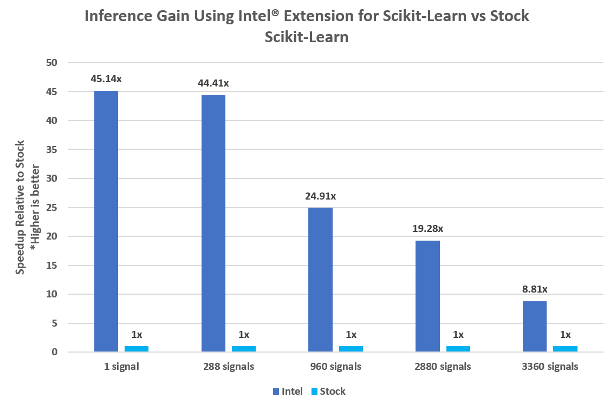

# **Power Line Fault Detection using Signal Processing**
The combination of python's mathematical libraries and machine learning (ML) provide a reference solution to detect faulty signals from measured power line voltage. With this solution, the detected signals can then be addressed early enough to avoid permanent and expensive damage.
# **Contents**
 - [Purpose](#purpose)
 - [Reference Solution](#reference-solution)
 - [Comparing Performance Benefits](#comparing-performance-benefits)
 - [Key Takeaways](#key-takeaways)
 - [Appendix](#appendix)

## **Purpose**
Faults in overhead electric transmission lines can lead to a destructive phenomenon called partial discharge (PD). If left alone, partial discharges can eventually destroy equipment. Overhead electric transmission lines run for hundreds of thousands of miles all over the U.S. alone, so manually inspecting the lines for damages that don’t cause an immediate outage is expensive. However, if left alone, undetected faulty lines can lead to partial discharges. Using ML to proactively detect partial discharges can reduce maintenance costs and prevent power outages and fires.

The purpose of this experiment is to process and analyze the signals from a 3-phase power supply system, used in power lines, to predict whether or not a signal has a partial discharge (which means it is faulty). Using SciPy and NumPy calculations, we first extracted features from the synthetic data signals we generated using python packages and open-source libraries, to then apply those features into a supervised ML pipeline using Random Forest Classification to infer the signal status. Intel® Extension for Scikit-Learn* is used to optimize this pipeline for better performance.

## **Reference Solution**
For data processing, we will use python libraries SciPy and NumPy. The signals – generated using periodic functions and Gaussian noise – are passed as NumPy arrays. Properties such as signal-to-noise ratio, peak features, etc. are used to extract features which will be used in ML model building. SciPy and NumPy are built to handle these heavy vector calculations on the arrays.

The features are then passed into a Random Forest model, which is trained and used to predict the faulty signals. Random Forest is a type of ensemble algorithm, which provides the benefits of increased performance and less chance of overfitting. This helps make the model applicable to the general problem rather than this specific dataset.

This section provides key implementation details on the proposed reference solution for the target use case. It is organized as follows:

1. Proposed reference end-to-end architecture
2. Setting up the stock environment
3. Executing the reference architecture pipeline (data loading and processing, supervised ML training/hyperparameter tuning and inference)
4. Optimizing the reference solution pipeline using Intel® packages


### **Proposed Architecture**
As mentioned before, the raw signal timeseries data and metadata is synthetically generated using a combination of TimeSynth and other NumPy/SciPy functions. Please follow the instructions provided in the `instructions.txt` file in the `/data` directory for installing TimeSynth for the first time or follow the environment setup below so that the data generation can execute as part of the pipeline. After this step, we use NumPy and SciPy to process these signals to denoise them for greater accuracy before extracting features to be passed onto training. The supervised ML model training is performed using Random Forest Classification, which is used because of its advantages of using ensemble learning: increased performance and less likelihood of overfitting. We also use hyperparameter tuning with cross validation to optimize the model configuration and increase accuracy for inference. The model can then be used for streaming or batch inference. This entire pipeline is run using one script, `run_benchmarks.py`.




### **Stock Packages Used**

- python v3.9.13
- numpy v1.23.5
- scipy 1.9.3
- scikit-Learn v1.1.3

### **Setting up Stock Environment**
Note that this reference kit implementation already provides the necessary scripts to setup the software requirements. To utilize these environment scripts, first install Anaconda/Miniconda by following the instructions at the following link if you do not already have Anaconda/Miniconda installed on your machine:

https://docs.conda.io/projects/conda/en/latest/user-guide/install/index.html

To clone this repository onto your local machine, run the following command from your terminal:
```
git clone https://github.com/oneapi-src/powerline-fault-detection
```

Once the repo is cloned, navigate to the parent directory. Follow the below conda installation commands to setup the Stock environment along with the necessary packages for this model training and prediction.
>Note: It is assumed that the present working directory is the root directory of this code repository

```
conda env create --file env/stock/signalProcessing-stock.yml
```
This command utilizes the dependencies found in the `env/stock/signalProcessing-stock.yml` file to create an environment as follows:

**YAML file**                       | **Environment Name**         |  **Configuration** |
| :---: | :---: | :---: |
| `env/stock/signalProcessing-stock.yml`      | `signalProcessing-stock` | python=3.9.x 

Use the following command to activate the environment that was created:
```shell
conda activate signalProcessing-stock
```

To install TimeSynth after activating your environment for the first time, please run:
```shell
pip install git+https://github.com/TimeSynth/TimeSynth.git
```

### **Synthetic Data**
>Note: Generating synthetic data is a part of this reference kit's pipeline execution, but it is not a part of the analysis and benchmarking. It is just the prerequisite step in the pipeline to have the data.

Each signal contains 10,000 floating point values depicting one cycle of voltage measured of a 50 Hz 3-phase system power line's voltage. 
Signal metadata includes the **signal ID**, **group ID** and **phase** since this is a 3-phase power system.
The dependent variable that we are trying to predict is whether or not the signal has PD, and this is the **target** variable. A **target** value of 0 is negative, which means the signal does not have partial discharge and is functioning normally, whereas a value of 1 means that it is a positive target, so there is partial discharge present and the signal is deemed faulty.


For reference, the table below shows what some rows from the signal dataframe may look like. Note that this is column-based, so the signal ID is the column name and the values in one column represent one signal's voltage measured at each time increment. <br>

| **0**                | **1**          | **2**                | **3**           | **...**
| :---                 | :---           | :---                 | :---            | :---
|-3.366481932	       |-13.24926079	| 10.85013064	       | 1.733765166     | ...
| -0.557262024	       | -11.95544088	| 13.95043041	       | 1.093923156     | ...
| -3.600549611         | -11.76913344	| 10.82880894	       | -0.157187225    | ...
| ...                  | ...            | ...                  | ...             | ...


For reference, the table below is what some rows from the metadata dataframe may look like. Note that here the signals IDs are row-based now, but the same ID is used to map to the relevant column in the signal dataframe. This means that the timeseries signal above in column "0" of the signal dataframe maps to the row with sig_id 0 below in the metadata dataframe. <br>

| **Sig_id**           | **Group_id**   | **Phase**        | **Target**          
| :---                 | :---           | :---             | :---            
| 0	                   | 0	            | 0	               | 0     
| 1	                   | 0	            | 1	               | 0    
| 2                    | 0	            | 2	               | 0    
| ...                  | ...            | ...              | ...      


### **Data Processing**
The raw synthetic data is then passed into functions in `data_processing.py` and called in `run_benchmarks.py` during code execution. The signals are individually processed to filter out the noise and extract relevant features. These extracted features are then combined into a dataframe which is then passed down to the ML pipeline for training and inference.


### **Model Training/Hyperparameter Tuning + Inference**
Once the features are generated, the data is now ready to be used in model training. Random Forest Classification is used in this instance for its advantages listed in previous sections as a supervised binary classification algorithm. The model is trained on 16 numeric features for each signal, with hyperparameter tuning and cross-validation integrated. The input for both training and inference is the same format features dataset, so we used a Scikit-Learn function to split the data into train and test input, with a 7:3 split ratio respectively. The default dataset size is 9600 so the training is performed on 6720 signals' feature data. An important step in the training function is hyperparameter tuning using grid search and cross validation. These techniques check combinations of hyperparameters for the model to be trained on and outputs the model that gives the most accurate results, which is then used for inferencing.

The model then runs either batch inference or simulated real-time inference, depending on the runtime configuration. As the test input ratio was 30%, batch inference is run on 2880 signals' feature data. Real-time inference is simulated and benchmarked by randomly sampling one signal from the test dataset 1000 times, saving each individual prediction as well as taking the average time for the 1000 iterations for our real-time benchmark. These functions are in `train_and_predict.py` and called in `run_benchmarks.py`.


###**Running Full Pipeline with Benchmarks**

Once we create and activate the virtual environment, we can run the benchmarks for evaluating performance gain for the entire pipeline using the python script `run_benchmarks.py`. 

The script **generates and processes the data**, **performs feature engineering**, **trains a Random Forest model with hyperparameter tuning**, and **performs inference using the trained model**. It also reports the time taken for relevant technologies at each step in the pipeline. 

> Before running the script, we need to ensure that the appropriate conda environment is activated.

The run benchmark script takes the following arguments:

```shell
usage: run_benchmarks.py [-l LOGFILE] [-i] [-s] [-n DATASET_LEN] [--save_data True/False]

arguments:
  -l, --logfile         log file to output benchmarking results to
  -i, --intel           use intel accelerated technologies where available
  -s, --streaming       run streaming inference if true
  -n, --dataset_len     number of signals to generate, ideally a multiple of 3
  --save_data           flag to determine whether or not to save generated data in /data directory
```

The default value for dataset_len is 9600 and for save_data it is True.

To run with stock technologies and batch inference for 3200 signals, log the performance to `logs`, and not save the synthetic data to a CSV, we would run in the parent directory (after creating the appropriate environment as above):
```shell
python ./src/run_benchmarks.py -l ./logs/stock_log -n 3200 --save_data False
```

To run for real-time inference and change the dataset size to 960 signals, run:
```shell
python ./src/run_benchmarks.py -s -l ./logs/stock_log -n 960
```
The log file name can be changed to describe the run.

**The following are all of the commands run for the benchmarking experiment using stock technologies after activating the `signalProcessing-stock` conda environment.**


For batch inference:
```shell
python ./src/run_benchmarks.py -l ./logs/stock_log -n 960 
```
```shell
python ./src/run_benchmarks.py -l ./logs/stock_log -n 3200 
```
```shell
python ./src/run_benchmarks.py -l ./logs/stock_log -n 9600 
```
```shell
python ./src/run_benchmarks.py -l ./logs/stock_log -n 11200 
```

For streaming inference, we only need to run one command to get the benchmark for streaming (since it is simulated by randomly sampling one signal from the test dataset 1000 times, saving each individual prediction as well as taking the average time for the 1000 iterations for our real-time benchmark):
```shell
python ./src/run_benchmarks.py -s -l ./logs/stock_log 
```

#### **Expected Input and Output for Each Step of Pipeline**

#### **Data Processing:**

| **Expected Input**     | **Expected Output**                   | **Comment**              
| :---                   | :---                                  | :---                
| Signal timeseries data as arrays of 10,000 floating point values, ie. [0.1, 1.2 ….. , 0.8, -0.2], and metadata, ie. [ {signal_id:0, group_id:0, phase:1, target:1}… {…} ] | Feature dataset to be used in training model, ie. {'noise_ratio’: 0.001, 'num_pos_peaks’: 147, 'num_neg_peaks’: 148, 'true_peaks_sd’: 2700, … } | Of the 16 numeric features, 1 is pre-processing and the rest are results after the signal gets filtered for noise 

#### **Training/Hyperparameter tuning:**

| **Expected Input**     | **Expected Output**                   | **Comment**              
| :---                   | :---                                  | :---                
| Signal features dataset | Trained RFC model which is best estimator of given parameters after hyperparameter tuning | The model is tuned for the following parameters: n_estimators, max_leaf_nodes, and max_estimators.


#### **Batch Prediction:**

| **Expected Input**     | **Expected Output**                   | **Comment**              
| :---                   | :---                                  | :---                
| Trained model and test data input | Array of prediction classes of whether a signal is faulty or not based on presence of partial discharge (0 for negative target = not faulty, and 1 for positive target = faulty), ie. {sig_id: target} ie. {… 56:1, 57:1, 58:0…} | The array is used to calculate accuracy and f1_scores for the model. 

#### **Streaming Prediction:**

| **Expected Input**     | **Expected Output**                   | **Comment**              
| :---                   | :---                                  | :---                
| Trained model and test data input, which is a single row randomly sampled multiple times to simulate real-time inference  | Prediction class for individually inferenced signals (0 for negative target and 1 for positive), ie. {sig_id: target} ie. {… 56:1, 57:1, 58:0…} | Primary objective of running streaming inference is to benchmark time taken for prediction. Average time for a single prediction (with 1000 trials) is written to the log file. Each prediction is still saved and returned in the same format as batch, but must be noted this is **not** the same as batch inference.


## **Optimizing the Reference Solution using Intel® Packages**
The reference solution architecture for an Intel®-optimized pipeline is unchanged except that each step in the pipeline is optimized using Intel® technologies for faster performance. The ML optimizations from Intel® Extension for Scikit-Learn* are enabled with a flag, shown in a later section below.


The **expected output** for the optimized is also the same as what we observe for the stock pipeline, just with accelerated times. This will be discussed more in the section for [Comparing Performance Benefits](#comparing-performance-benefits)

### **Intel® Packages Used**
- python v3.9.13
- numpy v1.23.5
- scipy 1.9.3
- scikit-Learn v1.1.3
- scikit-learn-intelex v2021.7.1

#### **Intel® Extension for Scikit-Learn**

Intel® Extension for Scikit-Learn* provides a seamless way to accelerate the stock Scikit-learn* package for machine learning. This extension package dynamically patches scikit-learn estimators to use Intel® oneAPI Data Analytics Library (oneDAL) as the underlying solver, which helps accelerate training and inference performance.

### **Setting up Intel® Environment**
Follow the below conda installation commands to setup the Intel® optimized environment along with the necessary packages for this model training and prediction.
>Note: It is assumed that the present working directory is the root directory of this code repository and that Anaconda/Miniconda has been installed on this machine

```
conda env create --file env/intel/signalProcessing-intel.yml
```
This command utilizes the dependencies found in the `env/intel/signalProcessing-intel.yml` file to create an environment as follows:

**YAML file**                       | **Environment Name**         |  **Configuration** |
| :---: | :---: | :---: |
| `env/intel/signalProcessing-intel.yml`      | `signalProcessing-intel` | python=3.9.x 

Use the following command to activate the environment that was created:
```shell
conda activate signalProcessing-intel
```
To install TimeSynth after activating your environment for the first time, please run:
```shell
pip install git+https://github.com/TimeSynth/TimeSynth.git
```


### **Running Optimized pipeline**

There will be only one change here compared to the command for training a model with the stock packages: an additional argument which enables the use of Intel®-optimized packages, which in the case of training/hyperparameter tuning is the usage of Intel® Extension for Scikit-Learn*. 

As an example, to run batch inferencing with Intel® technologies for 3200 signals and log the performance to `logs`, we would add the Intel® flag `-i` and run (after activating the Intel® environment):

```shell
python ./src/run_benchmarks.py -i -l ./logs/intel_log -n 3200
```
To run for real-time inference Intel® technologies for 960 signals, run the command:
```shell
python ./src/run_benchmarks.py -i -s -l ./logs/intel_log -n 960
```

**The following are all of the commands run for the benchmarking experiment using Intel® technologies after activating the `signalProcessing-intel` conda environment.**

For batch inference:
```shell
python ./src/run_benchmarks.py -i -l ./logs/intel_log -n 960 
```
```shell
python ./src/run_benchmarks.py -i -l ./logs/intel_log -n 3200 
```
```shell
python ./src/run_benchmarks.py -i -l ./logs/intel_log -n 9600 
```
```shell
python ./src/run_benchmarks.py -i -l ./logs/intel_log -n 11200 
```

For streaming inference, we only need to run one command to get the benchmark for streaming (since it is simulated by randomly sampling one signal from the test dataset 1000 times, saving each individual prediction as well as taking the average time for the 1000 iterations for our real-time benchmark):
```shell
python ./src/run_benchmarks.py -i -s -l ./logs/intel_log 
```

## **Comparing Performance Benefits**
In this section, we illustrate the benchmarking results comparing the Intel® technologies vs the stock alternative. We have performed testing for 4 dataset sizes: 960 signals, 3200 signals, 9600 signals, and 11200 signals. We experimented with multiple dataset sizes to see where we start seeing the greatest optimizations in performance as well as the plateaus. We break it down into the following tasks of this pipeline:

  1. Training a Random Forest model with hyperparameter tuning built-in
  2. Predicting outcomes over batch data using the trained RFC model  
  3. Repeating the inference exercise but for streaming data (run with the default size of 9600 signals)
  4. Due to the extreme skew in the distribution of data, we look at the F1 scores. As with accuracy, the higher the F1 score, the better the performance.


###**Machine Learning Results**

#### **Training Gain for RFC model using Intel® Extension for Scikit-Learn**



#### **Inference Gain for RFC model using Intel® Extension for Scikit-Learn**



####**Model Accuracy**
Looking at accuracy is important as well to determine a balance between performance speedup and at least matching accuracy compared to the stock version. Due to the skew in the dataset, we prioritize the F1 score as the model evaluation metric. Out of the dataset sizes benchmarked above, we saw that Intel® Extension for Scikit-Learn had an F1 score **23% lower** than the stock for n = 960 and starts to catch up and plateau at a score of about 0.80, with **-2% to +2%** difference between Intel® and stock for the remaining dataset sizes 3200, 9600 and 11200. This gives us an approximate lower bound for the dataset size to build an accurate enough model. Note that accuracy and speed are only two of many factors to consider when selecting the size of the batches, such as memory, processing power, etc.  

### **Key Results**
1. We see significant improvements in runtime performance for hyperparameter tuning/training pipeline with Intel® packages.
2. We see significant improvements in batch inference performance time using Intel® technologies, with more acceleration seen using smaller batch sizes.
3. For real-time inferencing (batch size = 1 signal), we see significantly accelerated performance using Intel® technologies.


## **Key Takeaways**
From this reference kit, we observe vast performance optimizations in speed and some in accuracy using Intel® Extension for Scikit-Learn. 

Fault detection with signal processing is a computationally expensive process, but with optimizations and cost-efficient data collection, the advantages of detecting partial discharge earlier will save much more money and resources in the long run by avoiding complete outages and failures. The maintenance costs, as well as the need for extensive power line repair, will be lower if the problem is caught early enough. 

### Notices & Disclaimers
Performance varies by use, configuration and other factors. Learn more on the [Performance Index site](https://edc.intel.com/content/www/us/en/products/performance/benchmarks/overview/).<br>
Performance results are based on testing as of dates shown in configurations and may not reflect all publicly available updates.  See backup for configuration details.  No product or component can be absolutely secure. <br>
Your costs and results may vary. <br>
Intel technologies may require enabled hardware, software or service activation.<br>
© Intel Corporation.  Intel, the Intel logo, and other Intel marks are trademarks of Intel Corporation or its subsidiaries.  Other names and brands may be claimed as the property of others.  <br>


## **Appendix**

### **Experiment Setup**
- **Date Testing Performed:** October 2022
- **Configuration Details and Workload Setup:** Azure D8v5 (Intel® Xeon® Platinum 8370C CPU @ 2.80GHz), 1 Socket, 4 Cores per Socket, 2 Threads per Core, Turbo:On, Total Memory: 32 GB, OS: Ubuntu 20.04, Kernel: Linux 5.15.0-1019-azure, Software: Scikit-Learn* v1.1.3, Intel® Extension for Scikit-Learn* v2021.7.1
- **Testing performed by** Intel Corporation


### **Experiment Setup**
| **Configuration**:                | **Description**
| :---                              | :---
| Platform                          | Microsoft Azure: Standard_D8s_v5 (IceLake) <br> Ubuntu 20.04
| Processing Hardware               | Intel IceLake Xeon Platinum 8370C CPU @ 2.8GHz <br> 32GB
| Software                          | **Stock**: Python(3.9.13), Scikit-Learn*(v1.1.3),  <br> **Intel**:  Python(3.9.13), Scikit-Learn*(v1.1.3), Intel® Extension for Scikit-Learn*(v2021.7.1)
| What you will learn               | Intel® oneAPI performance advantage over the stock versions on model training and inference

### **Acknowledgments**
The following are open-source codebases that helped with the foundation of this experiment:
- https://gist.github.com/suhaskv/4b40f1b8c88c9f38abe7d583997bb9f6#file-get_all_peaks-py
- https://www.kaggle.com/code/xhlulu/exploring-signal-processing-with-scipy/notebook

## **Notes**

**Please see this data set's applicable license for terms and conditions. Intel® does not own the rights to this data set and does not confer any rights to it.**